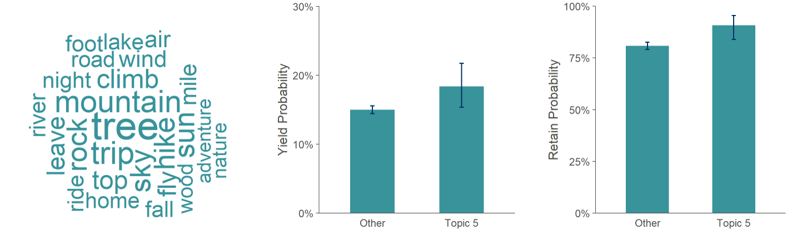

# Exploring College Admission Essay Topic Themes

### Introduction

Typically, when examining whether certain applicants are more or less likely to enroll and retain, we've relied on structured data --- such as demographic details and measure of past academic performance. While these data are easy to query and analyze, college applications consist of more than gender and standardized test scores. In particular, the college admissions essay is a core component of the application, yet it receives little attention from an analytics standpoint. In fact, I am not aware of any admissions office that have systemically analyzed the contents of admission essays and very little information about the significance of admissions essays exists within the literature.  

In this project, I identified topic themes within college admissions essays and investigated whether certain topics are predictive of yield and retention.    

### Project Overview

The purpose of this project was to explore college admission essays to determine whether there were an patterns in terms of what an applicant chose to write about and the likelihood that an applicant would enroll and/or retain. In doing so, I analyzed over sixteen thousand college admission essays from admitted, first-time-in-college students. 

### Pre-Processing Data

The text of each student's essay was stripped from an electronic copy of their application (i.e. a PDF) and pre-preprocessed. I won't list all of the steps or walkthrough the code, but here are highlights:

* **Lemmatizing words.** [Lemmatization](https://en.wikipedia.org/wiki/Lemmatisation) is a common technique when working with text data wherein words are reduced to their base form (e.g. grapes -> grape). This reduces the number of features within the model --- which improves computation time. Stemming is a similar method; however, stemming is more aggressive and the method and output is less intuitive. 
* **Removing stop words.** [Stop words](https://en.wikipedia.org/wiki/Stop_word) are common words that don't provide any real information about the content of a body of text. They include conjunctions, prepositions, and the like.
* **Removing low and high frequency words.** I also removed any word that appeared in more than 50% of essays as well as any word that appeared in less than 0.5% of essays. By filtering out extremely rare words, I further reduced the number of features in our model. Similarly, extremely common words are unlikely to provide much information either, so I removed them as well.  
* **Created document term matrix.** Finally, after whittling down the feature space, I cast the data to a document term matrix, which serves as the input for LDA function. 


### Topic Modeling

Next, I modelled the topic themes of essays using [Latent Dirichlet Allocation (LDA)](https://en.wikipedia.org/wiki/Latent_Dirichlet_allocation). LDA is an unsupervised learning technique used to identify topic themes within text. As an unsupervised process, the user specifies the number of topics to identify.

Note: There are other methods of topic modeling techniques and I explored some (e.g. CTM). However, the results were --- in general --- pretty similar to LDA and much more computationally expensive. 


#### Step 1: Initial Modeling

In the first step, I modelled the data for a range of topics --- from 5 to 150 topics --- using a five-fold cross validation approach. This is pretty time consuming, so I also parallelized the code to cut down the run time. 

To identify the number of topics to model, I assessed the fit of each model by calculating [perplexity](https://en.wikipedia.org/wiki/Perplexity) on the held-out data for each fold. Then, I graphed perplexity as a function of the number of topics. Ideally, you would select the model that produced the lowest perplexity score on the test data.  

However, as you can see below, perplexity steadily decreased as the number of topics increased without ever "bottoming-out." In hindsight, this was probably a predictable result, since applicants aren't really restricted in terms of what about they can write. But, modelling 150 topics --- or more --- isn't practical for a number of reasons. With such a large number of topics, the topics are extremely nuanced and too refined to helpful. Moreover, the sample size for any given topic is too small for any meaningful analysis with such a large number of topics. 


``` {r echo = FALSE, message = FALSE, fig.width = 9, fig.height = 3, fig.align = "center", warning = FALSE}

library(dplyr)
library(tidyr)
library(ggplot2)
library(knitr)

LDA <- read.csv("data & figures//LDA_tuning.csv")

LDA %>%
  ggplot() +
    geom_point(aes(x = topics,
                   y = perplexity_test)) +
    scale_x_continuous(name = "Number of Topics",
                       minor_breaks = NULL) +
    scale_y_continuous(name = "Perplexity (test data)",
                       minor_breaks = NULL) +
    theme(axis.ticks = element_blank()) -> plot_1

plot_1


```


Ultimately, I settled on thirty topics after manually reviewing the identified topics of several potential models. This number provided enough topic resolution while also ensuring an adequate sample size for further analyses. 


#### Step 2: Final Model & Data Cleaning

After determining the number of topics to identify, I simply re-ran the LDA function on the entire dataset with the selected number of topics specified. 

To indicate whether an essay contained significant themes of the topic in question, we used a cutoff of 0.15 for gamma (i.e. per-document-per-topic probability). This cutoff was chosen by manually reviewing the gamma values for several essays. It represents the threshold at which a human reader would be able to reliably detect a given topic theme.

Finally, the results of the topic modelling process were combined with data from other sources, which included demographic information, measures of academic performance, and enrollment history.   


### Results: Topic 5

Topic 5 centered on applicants’ experiences with the natural world. The figure below (left) shows the keywords most closely associated with Topic 5. Examples of Topic 5 essays include essays about hiking through forests, spending the summer at a lakeside cabin, and learning to appreciate nature while golfing. Not surprisingly, applicants who wrote about Topic 5 were twice as likely to indicate Environmental Studies as an intended major (10.8% vs 5.1%).  
 
Applicants who wrote about Topic 5 enrolled at a rate of 18.4% compared to 15.0% for students who did not write about Topic 5 (center), though this difference was not significant after controlling for sex, race, residency, and high school GPA. Similarly, we found no evidence that students interested in any particular major were more likely to enroll if they wrote about Topic 5.  
 
However, while these applicants were not necessarily more likely to enroll, they were more likely to be retained (right). Applicants who wrote about Topic 5 and enrolled at Eckerd College were retained at a rate of 90.8% versus 80.9%. This effect was significant when controlling for sex, race, residency, and high school GPA.  
 
Furthermore, among applicants who chose not enroll at Eckerd, individuals who wrote about Topic 5 were more likely to attend an out-of-state-school. 36.4% of domestic, Florida residents and 68.0% of domestic, non-Florida residents attended an out-of-state school if they wrote about Topic 5, compared to 26.1% and 62.8%, respectively. This suggests that distance is not a barrier to enrollment and may even be a motivating factor. 

```{r echo = FALSE, out.width = "100%"}



```

NOTE: Normally, I detest using word clouds for [lots](https://www.niemanlab.org/2011/10/word-clouds-considered-harmful/) [of](https://getthematic.com/insights/word-clouds-harm-insights/) [reasons](https://towardsdatascience.com/word-clouds-are-lame-263d9cbc49b7), but this is one of the few cases where they are useful. 

Together, these results suggest that these applicants are ideal prospects for Eckerd College. While financial incentives (e.g. scholarship funds) represent a possible method for luring these students to Eckerd College, a less costly strategy could involve the use of targeted marketing materials. Digital and/or printed promotional materials could be designed specifically for students who write about their experiences with nature. Such materials could highlight the diverse ecosystems of Florida and extoll the Environmental Studies program as well as relevant campus activities at Eckerd College (e.g. overnight kayaking trips offered through the waterfront).  

### Final Remarks

For the sake of brevity, I only presented the results for one of the thirty topics that I identified during this project. However, the results above demonstrate the types of analyses done for each of the thirty topics as well as the potential significance of the results. 

To date, we’ve identified roughly a dozen topics themes with interesting relationships --- or lack thereof --- with yield and/or retention, including essays about travel & culture exchange, social justice, and the environment and climate change. Going forward, we hope to work with admissions and marketing to design marketing materials that can be A/B tested and used in targeted marketing campaigns.

Because of FERPA, the data for this project --- including the college essays --- cannot be shared. That said, the R code for the initial topic modelling can be found [here](https://github.com/jason-hanser/college-admission-essays).

<br>
<br>